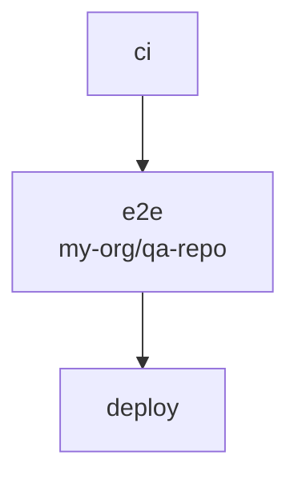
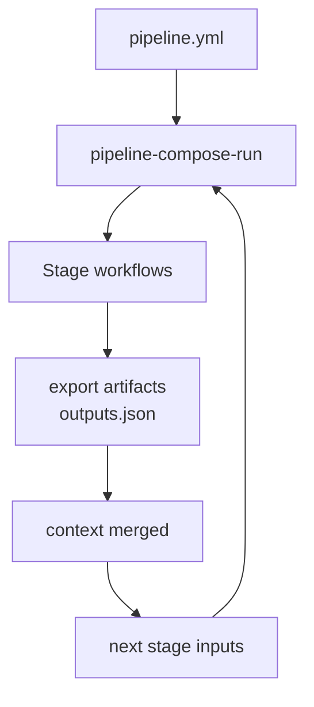

# pipeline-compose

**Cross-repo CI orchestration that stays inside GitHub Actions.**

`needs:` works great inside one repo. When your release spans a service repo, a QA repo, and an infra repo, you're back to `repository_dispatch`, PAT gymnastics, and tab-hopping across Actions runs with no shared context.

Pipeline Compose gives you one `pipeline.yml`: ordered stages, wait-for-completion, and `context.*` wiring across repos — without Jenkins, without custom polling scripts, without leaving Actions.

**Stable release:** **v1.16.0** — `validate --policy`, Rush import, Mermaid README diagrams. Cross-repo [GitHub App auth](docs/tutorials/github-app-setup.md) since v1.6.

## The problem

| What you have today | What breaks |
|---------------------|-------------|
| `repository_dispatch` | Fire-and-forget. No wait. No outputs back. |
| `workflow_call` | Same repo only. |
| PAT maps per target repo | Rotations, least-privilege pain, brittle local tokens. |
| Bash + `gh run view` polling | Nobody wants to maintain that. |

You don't need a second CI platform. You need **one pipeline graph** that Actions can actually execute.

## What you get

```yaml
# .github/pipelines/pipeline.yml
version: 2
pipelines:
  release:
    stages:
      - id: ci
        workflow: .github/workflows/ci.yml

      - id: e2e
        workflow: .github/workflows/e2e.yml
        repo: my-org/qa-repo
        needs: [ci]
        inputs:
          image_tag: ${{ context.ci.image_tag }}

      - id: deploy
        workflow: .github/workflows/deploy.yml
        needs: [e2e]
```



**[pipeline-compose-run](https://github.com/aeswibon/pipeline-compose-run)** dispatches each stage, polls until done, downloads `pipeline-compose-<stage>` artifacts, and builds `context` for the next stage. One workflow run. One result.

- **Synchronous** — unlike raw dispatch, the orchestrator waits and fails the pipeline if a stage fails.
- **Context merge** — stage workflows export JSON via [pipeline-compose-export](https://github.com/aeswibon/pipeline-compose-export); downstream stages read `context.<stage>.<key>`.
- **Declarative** — graph, `when:`, `needs:`, and cross-repo `repo:` live in YAML, not shell.

No generated workflow to commit unless you choose [pipeline-compose-compile](https://github.com/aeswibon/pipeline-compose-compile).

## Actions

| Action | Repository | Role |
|--------|------------|------|
| **Run** | [pipeline-compose-run](https://github.com/aeswibon/pipeline-compose-run) | Orchestrate stages (start here) |
| **Export** | [pipeline-compose-export](https://github.com/aeswibon/pipeline-compose-export) | Publish `outputs.json` artifact per stage |
| Compile | [pipeline-compose-compile](https://github.com/aeswibon/pipeline-compose-compile) | Generate a committed workflow from pipeline YAML |
| Eval | [pipeline-compose-eval](https://github.com/aeswibon/pipeline-compose-eval) | Evaluate `when:` expressions |
| Context merge | [pipeline-compose-context-merge](https://github.com/aeswibon/pipeline-compose-context-merge) | Manual context JSON without run |

Each action README includes a self-contained glossary.

## Quick start

**1. Pipeline file** — `pnpm run init` scans workflows and writes starter v2 YAML (`.github/pipelines/pipeline.yml`):

```yaml
version: 2
companion_workflows:
  - .github/workflows/release.yml
pipelines:
  release:
    stages:
      - id: ci
        workflow: .github/workflows/ci.yml
      - id: deploy
        workflow: .github/workflows/deploy.yml
        needs: [ci]
```

**2. Export** in any stage workflow that declares `outputs:`:

```yaml
- uses: aeswibon/pipeline-compose-export@v1.16.0
  if: success()
  with:
    stage_id: ci
    outputs: '{"image_tag":"${{ steps.build.outputs.tag }}"}'
```

**3. Entry workflow** (e.g. tag push):

```yaml
- uses: aeswibon/pipeline-compose-run@v1.16.0
  with:
    pipeline_file: .github/pipelines/pipeline.yml
```

**Cross-repo?** Add `repo: org/repo` on the stage and configure a [GitHub App](docs/tutorials/cross-repo-pipeline.md) (`github_app_id` + `github_app_private_key`) or `repo_tokens_json` on the run action.

Copy-paste examples: [examples/](examples/) · Tutorial: [docs/tutorials/tag-release-pipeline.md](docs/tutorials/tag-release-pipeline.md)

## Developer ergonomics

| Tool | What it does |
|------|----------------|
| `validate --strict --workflows` | Schema, DAG, orphans, cross-repo token gaps — fail CI before merge |
| `validate --simulate` | Dry-run stage table: skips, waves, missing context |
| `validate --mermaid` | Topology graph for PRs and docs |
| `catalog` / `catalog_from` | Reuse stage templates; pull catalog from another repo |
| `import turbo` / `import nx` / `import rush` | Generate pipeline YAML from monorepo task graphs |
| `smart_rerun` | Re-run failed pipelines; reuse unchanged stages |
| `context_schema` | JSON Schema for wiring; optional runtime check on export |

PRs that touch pipeline YAML can get a mermaid + simulate + issues comment (see `.github/workflows/pipeline-pr-comment.yml` in this repo).

## Mental model



**Good fit:** poly-repo release trains, platform-owned stage catalogs, validate-before-merge DAGs.

**Probably not:** single-repo linear CI (native `needs:` is enough), or full deployment-platform features (Spinnaker, Argo CD, etc.).

## CLI (monorepo / local)

```bash
pnpm run init          # scan workflows → starter pipeline.yml; infers outputs + context_schema from export steps
pnpm run import turbo  # turbo.json → .github/pipelines/imported.yml (or import nx / import rush)
pnpm run validate .github/pipelines/pipeline.yml --repo-root . --workflows --strict --mermaid
pnpm run compile .github/pipelines/pipeline.yml -o .github/workflows/pipeline-generated.yml
```

See [docs/development.md](docs/development.md) for the full command list and release process.

## Documentation

| Topic | Location |
|-------|----------|
| **Design rationale (series)** | [docs/design/](docs/design/) — why this architecture, per-feature decisions |
| Run + export setup | [pipeline-compose-run](https://github.com/aeswibon/pipeline-compose-run) |
| Examples (copy `.github/`) | [examples/](examples/) |
| Tag release walkthrough | [docs/tutorials/tag-release-pipeline.md](docs/tutorials/tag-release-pipeline.md) |
| Cross-repo `repo:` stages | [docs/tutorials/cross-repo-pipeline.md](docs/tutorials/cross-repo-pipeline.md) |
| Mermaid topology + PR bot | [docs/mermaid-demo.md](docs/mermaid-demo.md) |
| Monorepo development | [docs/development.md](docs/development.md) |
| Glossary | [docs/glossary.md](docs/glossary.md) |
| **1.0 GA / breaking changes** | [docs/migration/v1.0.md](docs/migration/v1.0.md) |
| Upgrading from 0.5 | [docs/migration/v0.5.md](docs/migration/v0.5.md) |
| Pipeline schema (v2) | [packages/core/schema/pipeline-v2.schema.json](packages/core/schema/pipeline-v2.schema.json) |
| Publishing action repos | [docs/action-repos.md](docs/action-repos.md) |

## Local CI with act

```bash
pnpm run act:full    # tests, validate, compile parity, bundles
pnpm run act:ci      # unit tests + build
```

Requires [Docker](https://docs.docker.com/get-docker/) and [act](https://github.com/nektos/act). See [.github/act/README.md](.github/act/README.md).

## License

[MIT](LICENSE)
