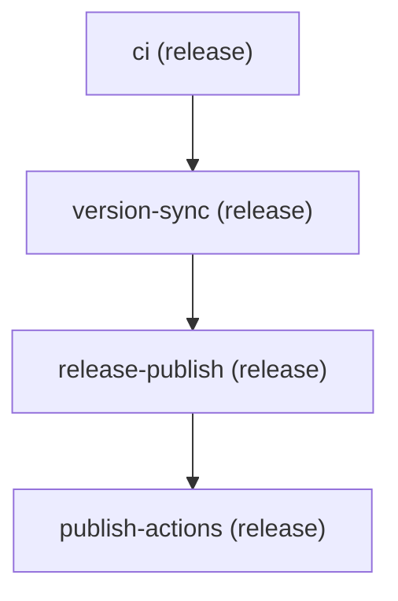

# 13 — Meta release pipeline (dogfooding)

**Series:** [Design rationale](README.md) · **Prev:** [12 — Validation, simulate, and PR feedback](12-validation-simulate-and-pr-bot.md)

## Executive summary

The **pipeline-compose monorepo releases itself** through pipeline-compose-run: tag push → orchestrated stages → version sync → GitHub Release → action repo publish. This part maps **series concepts to real files** so reviewers can audit our own choices—not a hypothetical example.

---

## Context

### Why dogfood matters

If maintainers will not run the orchestrator on production releases, adopters should not either. The meta pipeline is:

- Integration test in prod (every tag)
- Reference architecture for same-repo multi-workflow release
- Proof that validate/compile parity CI matches shipped behavior

---

## The graph

**File:** [`.github/pipelines/pipeline.yml`](../../.github/pipelines/pipeline.yml)



| Stage | Workflow | Role |
|-------|----------|------|
| `ci` | `ci.yml` | Tests, build, lint — gate before version bump |
| `version-sync` | `stage-version-sync.yml` | Reads/writes version files; exports `version`, `skip_publish` |
| `release-publish` | `stage-release-publish.yml` | Creates meta repo GitHub Release |
| `publish-actions` | `publish-actions.yml` | Bundles and pushes five action repos |

**Entry:** [`.github/workflows/release.yml`](../../.github/workflows/release.yml) runs `aeswibon/pipeline-compose-run@v1.10.0` with `pipeline_file: .github/pipelines/pipeline.yml`.

---

## Design choices in this pipeline

### 1. Run path, not compile

**Decision:** dynamic orchestrator on tag push.

**Why here:** release chain changes with product (new stages like `publish-actions`); we want pipeline.yml as source of truth without regenerating a committed mega-workflow. Same-repo; compile would work—but run exercises the product we ship.

See [04 — Run path vs compile path](04-run-path-vs-compile-path.md).

### 2. Context wiring (export contract)

`version-sync` declares:

```yaml
outputs:
  - version
  - skip_publish
```

Downstream stages consume:

```yaml
inputs:
  version: ${{ context.version-sync.version }}
  skip_publish: ${{ context.version-sync.skip_publish }}
```

**Invariant:** `stage-version-sync.yml` must run **pipeline-compose-export** with `stage_id: version-sync` or release stops with missing context—see [03](03-context-and-export-contract.md).

`publish-actions` only needs `version` from context; it does not re-run version logic.

### 3. `concurrency`

```yaml
concurrency:
  group: release-${{ github.ref }}
  cancel_in_progress: false
```

**Rationale:** one release per tag ref; do not cancel in-flight release if someone retags (rare). Run action enforces via [concurrency emulation](02-orchestration-model.md).

### 4. `companion_workflows`

Listed companions include `release.yml`, `smoke-cross-repo.yml`, `pipeline-pr-comment.yml`—not pipeline stages.

**Why:** strict validate `--workflows` would flag them as orphans ([12](12-validation-simulate-and-pr-bot.md)). Companions document “intentional non-stage workflows.”

### 5. No cross-repo stages (in this pipeline)

Meta release is **same-repo**. Cross-repo auth ([10](10-cross-repo-authentication.md)) is demonstrated in `examples/cross-repo-dispatch/` and `smoke-cross-repo.yml`, not in the release DAG—keeps release secrets limited to `GITHUB_TOKEN` + publish token on final stage.

### 6. No smart rerun on release (default)

`smart_rerun` is not enabled on meta pipeline.

**Rationale:** `version-sync` and `release-publish` are **mutating** (git tags, GitHub Release). Reusing outputs on retry could skip version bump while fixing a later stage—dangerous. Smart rerun fits **read-heavy** upstream stages; see [06](06-smart-rerun.md) idempotency section.

**Operational pattern:** fix failed stage workflow; re-run failed jobs on entry workflow—full stages re-execute (safe for mutators).

### 7. Groups metadata

`group: release` on pipeline + stages supports validate conventions and mermaid labels—not execution order (order is `needs:` only).

---

## How a tag release flows (operations)

1. Maintainer merges release prep; tags `vX.Y.Z`; pushes tag.
2. `release.yml` triggers; run action loads pipeline `release`.
3. **ci** dispatches `ci.yml` — must pass.
4. **version-sync** runs; export artifact `pipeline-compose-version-sync`.
5. **release-publish** receives version inputs; creates GitHub Release on meta repo.
6. **publish-actions** receives version; `publish-action-packages.sh` tags action repos.

Failure at any stage **fails the entry workflow**; later stages do not run ([02](02-orchestration-model.md)).

---

## CI vs release pipeline

Do not confuse:

| System | File | Purpose |
|--------|------|---------|
| **PR CI** | `.github/workflows/ci.yml` | Validates every push/PR |
| **Release pipeline stage `ci`** | same `ci.yml` | Re-run CI as gate before version bump on tag |

The release graph **re-dispatches** CI as stage 1 so a green tag always re-proves tests—even if tag was created from an older commit SHA (operator discipline still matters).

---

## Validate this pipeline locally

```bash
pnpm run validate .github/pipelines/pipeline.yml \
  --repo-root . --workflows --strict --mermaid

pnpm run validate .github/pipelines/pipeline.yml \
  --repo-root . --workflows --strict --simulate \
  --github '{"ref":"refs/tags/v1.10.0","event_name":"push"}'
```

PRs touching `pipeline.yml` get bot comment automatically.

---

## Mapping series → this repo

| Series part | Meta pipeline instance |
|-------------|------------------------|
| [02 Orchestration](02-orchestration-model.md) | Four dispatch stages, linear `needs:` |
| [03 Context](03-context-and-export-contract.md) | `version-sync` → `release-publish` / `publish-actions` |
| [05 Monorepo](05-monorepo-and-action-repos.md) | `publish-actions` stage |
| [12 Validate](12-validation-simulate-and-pr-bot.md) | `companion_workflows`, PR bot |
| [06 Smart rerun](06-smart-rerun.md) | Intentionally off for mutating stages |
| [10 Cross-repo](10-cross-repo-authentication.md) | Not used in this graph |

---

## Revisit criteria

- Split **publish-actions** to parallel wave after `version-sync` if action repos publish becomes independent of GitHub Release body.
- Enable **smart rerun** only on `ci` stage with fingerprint including commit SHA (optional optimization).
- Add **`context_schema`** to freeze version contract between stages ([09](09-typed-context-schema.md)).

---

## What to read next

- [14 — Global concurrency](14-global-concurrency.md)
- [15 — Remote catalog fetch](15-remote-catalog-fetch.md)

## Series index

[README](README.md)
