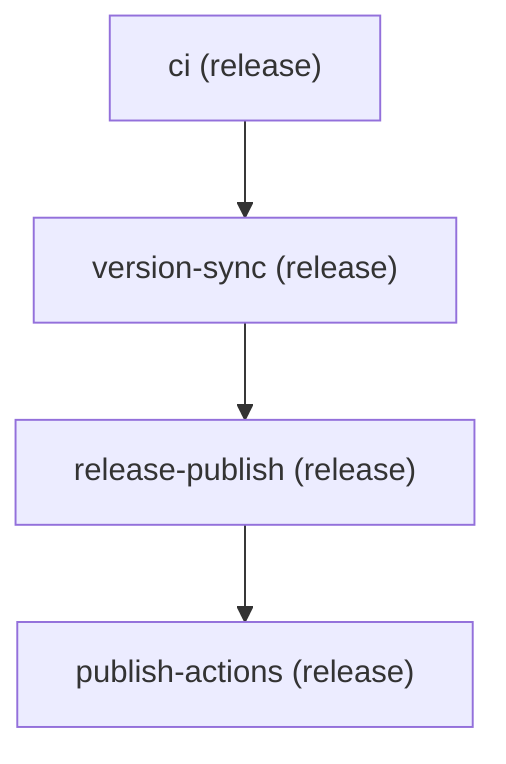

# Mermaid pipeline diagrams

`validate --mermaid` prints a [Mermaid](https://mermaid.js.org/) flowchart of stage topology: one node per stage (id, group, optional cross-repo target) and edges from `needs:`.

## Local CLI

From the repo root:

```bash
pnpm run validate .github/pipelines/pipeline.yml \
  --repo-root . --workflows --strict --mermaid
```

| Flag | Effect |
|------|--------|
| `--mermaid` | Print `flowchart TD` after validation |
| `--json` | JSON report instead of human text (do not combine with `--mermaid`) |
| `--workflows` | Resolve workflow files under `--repo-root` |
| `--strict` | Promote deprecation warnings to errors (matches CI) |

Exit code follows validation (errors or strict warnings), not whether Mermaid printed successfully.

### This repo’s release pipeline



Solid arrows (`-->`) come from explicit `needs:` in `.github/pipelines/pipeline.yml`. When a stage has no `needs:`, the renderer falls back to file order with dotted arrows (`-.->`).

### Smaller example

```bash
pnpm run validate examples/run-tag-release/.github/pipelines/pipeline.yml \
  --repo-root examples/run-tag-release --mermaid
```

### Preview elsewhere

1. Copy the CLI output (from `flowchart TD` through the last edge).
2. Paste into [mermaid.live](https://mermaid.live), or wrap in a fenced block in any Markdown file GitHub renders.

## PR bot (GitHub)

Workflow: [`.github/workflows/pipeline-pr-comment.yml`](../.github/workflows/pipeline-pr-comment.yml)

**Triggers** on pull requests that change:

- `.github/pipelines/**`
- `packages/core/schema/**`

**Behavior:**

1. Runs `validate --workflows --strict --mermaid` and `--json`.
2. Posts or updates a sticky PR comment (`<!-- pipeline-compose-pr-bot -->`) with status, the Mermaid diagram, and a bullet list of issues.

### Try it

```bash
git checkout -b test/mermaid-pr-bot
# Add a harmless comment at the top of .github/pipelines/pipeline.yml, e.g.:
#   # mermaid demo — safe to revert
git add .github/pipelines/pipeline.yml
git commit -m "docs: trigger pipeline PR comment for mermaid demo"
git push -u origin test/mermaid-pr-bot
gh pr create --title "Test pipeline mermaid PR comment" --body "$(cat <<'EOF'
Smoke-test for \`validate --mermaid\` PR bot. Revert or close after confirming the comment.

EOF
)"
```

On the PR **Checks** tab, confirm **Pipeline PR comment** succeeds. On the **Conversation** tab, look for **Pipeline Compose validation** with the same topology diagram as above.

Updating the pipeline file on the same PR refreshes the existing comment (same marker), it does not spam new comments.

## See also

- [development.md](development.md) — local validate flags
- [glossary.md](glossary.md) — `validate --mermaid` entry
- [migration/v0.5.md](migration/v0.5.md) — schema v2 and strict deprecations
