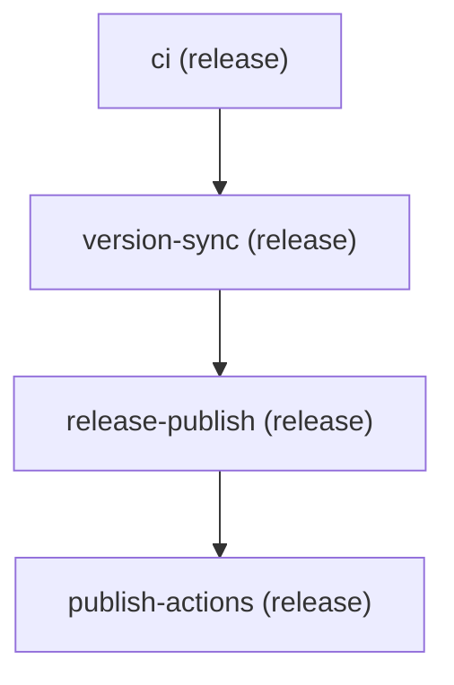
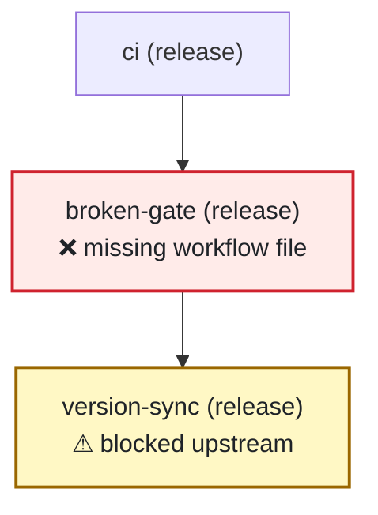

# Mermaid pipeline diagrams

`validate --mermaid` prints a [Mermaid](https://mermaid.js.org/) flowchart of stage topology: one node per stage (id, group, optional cross-repo target) and edges from `needs:`.

On pull requests that change `.github/pipelines/**`, the [**Pipeline PR comment**](../.github/workflows/pipeline-pr-comment.yml) workflow posts the same diagram plus validate status and issues.

## Local CLI

From the repo root:

```bash
pnpm run validate .github/pipelines/pipeline.yml \
  --repo-root . --workflows --strict --mermaid
```

| Flag | Effect |
|------|--------|
| `--mermaid` | Print `flowchart TD` after validation |
| `--json` | JSON report instead of human text (do not combine with `--mermaid`) |
| `--workflows` | Resolve workflow files under `--repo-root` |
| `--strict` | Promote deprecation warnings to errors (matches CI) |

Exit code follows validation (errors or strict warnings), not whether Mermaid printed successfully. Mermaid is rendered from the parsed pipeline even when validate fails, as long as the YAML loads (schema + stage `needs:` must be valid).

### This repo’s release pipeline



Solid arrows (`-->`) come from explicit `needs:` in `.github/pipelines/pipeline.yml`. When a stage has no `needs:`, the renderer falls back to file order with dotted arrows (`-.->`).

When validate finds issues, the diagram annotates nodes:

| Style | Meaning |
|-------|---------|
| **Red node** (`❌ …`) | Validation error on that stage (e.g. missing workflow file) |
| **Amber node** (`⚠ blocked upstream`) | Stage depends on a broken upstream stage via `needs:` |

Example (same shape as [PR #6](https://github.com/aeswibon/pipeline-compose/pull/6)):



### Smaller example

```bash
pnpm run validate examples/run-tag-release/.github/pipelines/pipeline.yml \
  --repo-root examples/run-tag-release --mermaid
```

### Preview elsewhere

1. Copy the CLI output (from `flowchart TD` through the last edge).
2. Paste into [mermaid.live](https://mermaid.live), or wrap in a fenced block in any Markdown file GitHub renders.

## PR bot (GitHub)

Workflow: [`.github/workflows/pipeline-pr-comment.yml`](../.github/workflows/pipeline-pr-comment.yml)

**Triggers** on pull requests that change:

- `.github/pipelines/**`
- `packages/core/schema/**`

**Behavior:**

1. Runs `validate --workflows --strict --mermaid` and `--json`.
2. Posts or updates a sticky PR comment (`<!-- pipeline-compose-pr-bot -->`) with status, the Mermaid diagram, and a bullet list of issues.

Updating the pipeline file on the same PR refreshes the existing comment (same marker), it does not spam new comments.

### Sample pull requests

These closed PRs were used to smoke-test the bot on this repo:

| PR | Scenario | What to look for |
|----|----------|------------------|
| [#5 — Test pipeline mermaid PR comment](https://github.com/aeswibon/pipeline-compose/pull/5) | Valid pipeline change | **Status: OK**, four-stage topology, _No issues._ |
| [#6 — Test mermaid PR comment on validation failure](https://github.com/aeswibon/pipeline-compose/pull/6) | Intentional break (`broken-gate` → missing workflow) | **Status: Failed**; `broken-gate` node shows **❌ missing workflow file**; downstream stages show **⚠ blocked upstream** |

PR #6 also shows that **`Pipeline validate` CI can fail** while the PR comment job still completes and posts the diagram.

**Break cases that still render Mermaid:** missing workflow files, deprecation/strict errors, group/path warnings promoted under `--strict`.

**Break cases that do not render Mermaid:** invalid YAML/schema, or unknown stage id in `needs:` (validate exits before topology render).

### Try it locally before opening a PR

```bash
git checkout -b test/mermaid-pr-bot
# Touch .github/pipelines/pipeline.yml (comment or stage change)
pnpm run validate .github/pipelines/pipeline.yml --repo-root . --workflows --strict --mermaid
git commit -am "test: trigger pipeline PR comment"
git push -u origin test/mermaid-pr-bot
gh pr create --title "Test pipeline mermaid PR comment" --body "Smoke-test PR bot."
```

## See also

- [development.md](development.md) — local validate flags
- [glossary.md](glossary.md) — `validate --mermaid` entry
- [migration/v0.5.md](migration/v0.5.md) — schema v2 and strict deprecations
